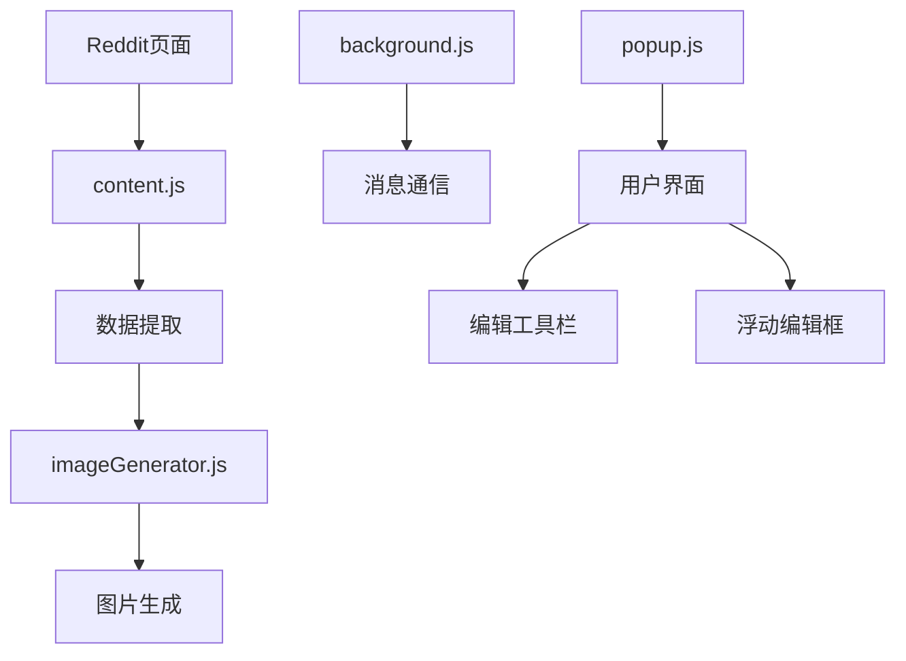

# AI开发文档 - Reddit to 小红书转换插件

## 系统架构图


## 核心数据流
1. 数据获取流:
```javascript
URL -> PostID -> Reddit API -> 原始数据 -> 解析处理 -> 结构化数据
```

2. 图片生成流:
```javascript
结构化数据 -> 布局计算 -> Canvas绘制 -> 图片导出
```

3. 编辑流:
```javascript
预览图片 -> 双击触发 -> 浮动编辑框 -> 内容修改 -> 保存更新 -> 重新生成预览
```

## 关键依赖关系
- content.js 依赖 Reddit API
- imageGenerator.js 依赖 Canvas API
- 所有组件依赖 Chrome Extension API

## 技术债务追踪
1. Canvas性能优化 [待处理]
   - 大量文本渲染时性能下降
   - 需要实现分块渲染

2. 字体加载问题 [待处理]
   - emoji支持不完整
   - 中文字体兼容性待优化

3. 错误处理完善 [待处理]
   - API请求失败重试机制
   - 图片生成失败降级方案

4. 编辑功能优化 [已修复]
   - 二次编辑内容持久化问题
   - 编辑后预览显示问题

## 开发日志

### 当前状态
- 项目初始化完成
- 基础功能框架搭建
- 文档系统建立
- 编辑工具栏功能实现
- 浮动编辑框功能实现
- 编辑功能问题修复

### 最新更新
1. 编辑工具栏功能:
   - 实现标题、正文、颜色、背景设置
   - 添加参数实时调整
   - 支持预览实时更新

2. 浮动编辑框功能:
   - 双击预览图片触发
   - 支持文本内容编辑
   - 实现保存和取消功能
   - 添加遮罩层和关闭按钮

3. 编辑功能修复:
   - 修复二次编辑内容丢失问题
   - 优化编辑后预览更新逻辑
   - 完善数据结构保存机制
   - 添加完整的错误处理

## AI理解指南

### 数据结构
```typescript
interface RedditPost {
  title: string;
  translatedTitle: string;
  author: string;
  content: string[];
  translatedContent: string[];
  subreddit: string;
  subredditIcon: string;
  comments: Comment[];
}

interface Comment {
  author: string;
  content: string;
  translatedContent: string[];
  score: number;
  parent_id: string;
}
```

### 关键配置参数
```javascript
{
  width: 1080,
  padding: 65,
  titleFontSize: 50,
  contentFontSize: 32,
  headerHeight: 160,
  aspectRatio: 1.333333
}
```

### 错误码映射
```javascript
const ErrorCodes = {
  API_FAILED: 'E001',
  IMAGE_LOAD_FAILED: 'E002',
  RENDER_FAILED: 'E003',
  EDIT_SAVE_FAILED: 'E004'
};
```

## 代码质量指标
1. 复杂度热点
   - imageGenerator.js:wrapText() [圈复杂度: 15]
   - content.js:extractComments() [圈复杂度: 8]
   - initializeFloatingEditor() [圈复杂度: 5]
   - saveEdit() [圈复杂度: 6]

2. 性能热点
   - Canvas文本渲染
   - Reddit API请求
   - 预览图片生成
   - 编辑状态同步

## 测试覆盖
- 单元测试: 待实现
- 集成测试: 待实现
- E2E测试: 待实现

## 优化方向
1. 性能优化
   - [ ] 实现WebWorker处理图片生成
   - [ ] 添加数据缓存层
   - [ ] 优化Canvas渲染策略
   - [x] 优化编辑状态同步

2. 功能增强
   - [x] 支持自定义模板
   - [x] 实现文本编辑功能
   - [ ] 批量转换功能
   - [ ] 多语言支持

3. 用户体验
   - [x] 添加进度提示
   - [x] 优化错误提示
   - [x] 支持预览功能
   - [x] 实现双击编辑
   - [x] 优化编辑体验

## AI注意事项
1. 代码修改时需注意:
   - 保持异步操作的错误处理
   - 维护现有的类型定义
   - 遵循已建立的模块化结构
   - 确保编辑功能的状态同步
   - 保持数据结构的完整性

2. 新功能开发指南:
   - 遵循现有的消息通信模式
   - 保持与Chrome Extension API的兼容性
   - 注意内存使用限制
   - 保持UI交互的一致性

3. 调试建议:
   - 使用Chrome DevTools调试Canvas渲染
   - 监控Reddit API的响应时间
   - 注意跨域请求限制
   - 检查编辑状态的同步
   - 验证数据结构完整性

## 版本历史
```json
{
  "0.1.1": {
    "date": "当前版本",
    "features": [
      "修复二次编辑内容丢失问题",
      "优化编辑后预览更新逻辑",
      "完善数据结构保存机制",
      "添加完整的错误处理"
    ],
    "fixes": [
      "修复编辑内容持久化问题",
      "修复预览显示更新问题",
      "修复数据结构不完整问题"
    ]
  },
  "0.1.0": {
    "date": "初始版本",
    "features": [
      "项目初始化",
      "基础框架搭建",
      "编辑工具栏实现",
      "浮动编辑框功能"
    ],
    "fixes": []
  }
}
``` 